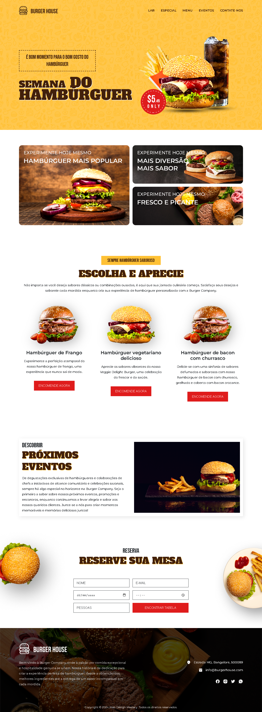

<h1 align="center"> Hamburgueria </h1>

Herói: Uma seção de boas-vindas com uma introdução à sua Hamburgueria inclui um menu de navegação.

Sobre: ​​Informações sobre a história e a missão da sua Hamburgueria.

Menu: Detalhes sobre os produtos e serviços que você oferece.

Depoimentos: Por que os clientes adoram sua Hamburgueria (controle deslizante).

Galeria: uma vitrine do ambiente e das ofertas da sua Hamburgueria.

Contato: Um formulário ou informações de contato para os visitantes entrarem em contato.

Rodapé: Links e informações adicionais, como perfis de mídia social.  
<a href="https://lp.rocketseat.com.br/devlinks/inscricao?utm_source=github&utm_medium=descricao&utm_campaign=capture-devlinks&utm_term=organic&utm_content=descricao-github-mayk-brito">Estude esse projeto em formato de vídeo clicando aqui.</a>

  <a href="#-tecnologias">Tecnologias</a>&nbsp;&nbsp;&nbsp;|&nbsp;&nbsp;&nbsp;
  <a href="#-projeto">Projeto</a>&nbsp;&nbsp;&nbsp;|&nbsp;&nbsp;&nbsp;
  <a href="#-layout">Layout</a>&nbsp;&nbsp;&nbsp;|&nbsp;&nbsp;&nbsp;
  <a href="#memo-licença">Licença</a>

  

 

  

## 🚀 Tecnologias

Esse projeto foi desenvolvido com as seguintes tecnologias:

- HTML e CSS
- JavaScript

## 💻 Projeto

Landing Page interativa para hamburgueria, com foco em experiência do usuário e conversão. Design clean e moderno, com destaque para o cardápio e promoções. Integração com opções de pedido online e contato.

- [Acesse o projeto finalizado, online]( )

## 🔖 Layout

Você pode visualizar o layout do projeto através [DESSE LINK]( ). É necessário ter conta no [Figma](https://figma.com) para acessá-lo.

## :memo: Licença

Esse projeto está sob a licença MIT.

---

Feito com ♥ by Germano Lucas.
